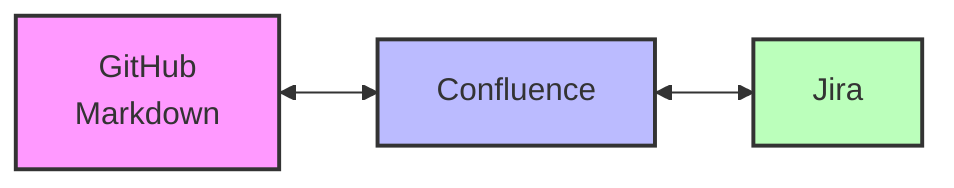
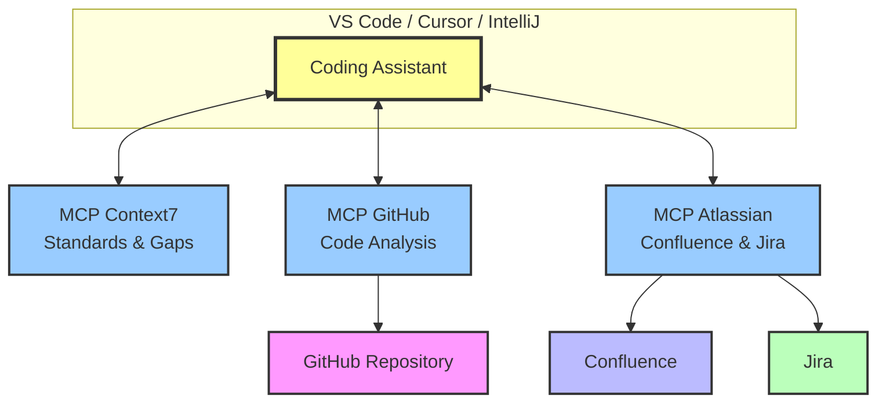
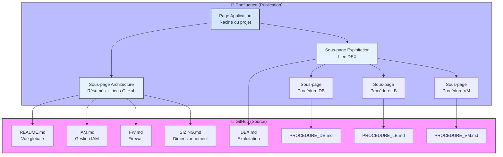
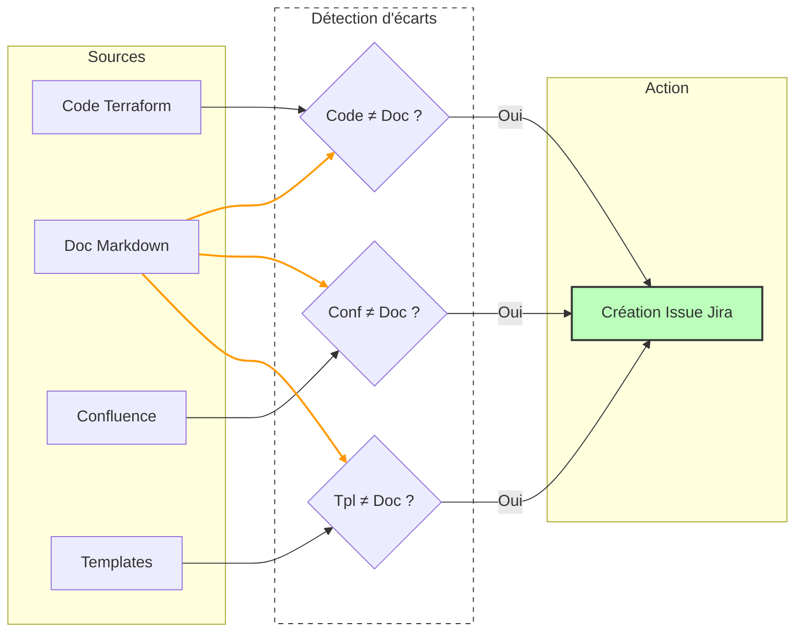

# DAT as Code : automatiser la documentation technique avec l'IA

## Introduction

L'année dernière, j'ai écrit un [guide pour moderniser son DAT (Dossier d'Architecture Technique)](https://dev.to/onepoint/moderniser-son-dossier-darchitecture-technique-guide-pratique-pour-2024-7d6). Un an après, avec l'arrivée des coding assistants et leurs connecteurs, je me suis demandé : **qu'est-ce qu'on peut vraiment faire avec l'IA pour maintenir un DAT ?**

J'ai testé sur un projet Terraform. 
Objectif : partir de zéro et arriver à une doc complète (architecture + exploitation) avec le moins d'effort possible.

Spoiler : en 2h de setup, c'est fait.

## La découverte : templates + prompts

Premier test avec un coding assistant : je lui donne un fichier markdown avec une structure (titres, sections) et j'y glisse des instructions dans des commentaires HTML `<!-- -->`.

Genre `<!-- décris ici les composants principaux en 5 lignes -->`.

Et ça marche. Le coding assistant suit la structure et remplit chaque section selon les consignes.

'''
## 🏗️ Prérequis

<!-- insérer prérequis techniques (Terraform et autres identifiés dans le code) -->

## Description de la gestion IAM

<!-- 
créer un fichier à partir du template TPL_README_IAM.md
insérer lien vers page iam
exemple: [IAM](./docs/doc_iam.md)
 -->
'''

Ça peut paraître con mais c'est le plus efficace que j'ai testé pour garder une cohérence de style documentaire globale.

## Le problème : 3 outils à synchroniser

Dans un projet classique, on jongle avec :
- **GitHub** : markdown en doc-as-code
- **Confluence** : pour la recherche et facilité de lecture
- **Jira** : pour tracer les issues et projets

Maintenir Confluence à jour à la main, c'est l'enfer. 
On aimerait pouvoir le faire dans GitHub à côté du code, mais c'est moins pratique pour la recherche et la facilité de lecture.
Et on veut éviter de se retrouver avec de la redite partout.

Ce qui paraît le plus adapté, c'est écrire la doc avec le code et mettre Confluence à jour en conséquence, avec des liens et des références vers la doc sur GitHub.



## La solution : MCP (Model Context Protocol)

Les MCP, c'est des connecteurs pour que ton coding assistant discute avec des services externes. J'en ai identifié trois essentiels pour ce projet :

**Context7** : vérifie que la doc respecte les standards et détecte ce qui manque.

**GitHub** : lit le code (Terraform dans mon cas) pour extraire l'info architecture.

**Atlassian** : s'interface avec Confluence et Jira.



## Setup

J'installe les 3 MCP dans mon IDE (VsCode dans mon cas, mais ça marche avec Cursor, IntelliJ, etc.).

Pour Atlassian, je configure dans `.vscode/settings.json` :
- URL de la page Confluence du projet
```json
{
    // Configuration MCP
    "mcp.confluence.enabled": true,
    "mcp.confluence.baseUrl": "https://votre-domaine.atlassian.net",
    "mcp.confluence.defaultSpace": "SPACE_KEY",
    "mcp.jira.enabled": true,
    "mcp.jira.baseUrl": "https://votre-domaine.atlassian.net",
    "mcp.jira.defaultProject": "PROJECT_KEY",
    "mcp.servers": {
        "confluence": {
            "command": "mcp-confluence",
            "args": [
                "--space",
                "SPACE_KEY",
                "--page-id",
                "PAGE_ID"
            ]
        },
        "jira": {
            "command": "mcp-jira",
            "args": [
                "--project",
                "PROJECT_KEY",
                "--board",
                "BOARD_ID"
            ]
        }
    }
}
```

Pour récupérer ces valeurs :

**Confluence** (`https://domaine.atlassian.net/wiki/spaces/MON_ESPACE/pages/12345678/Titre`)
* `SPACE_KEY` = `MON_ESPACE`
* `PAGE_ID` = `12345678`

**Jira** (`https://domaine.atlassian.net/jira/software/c/projects/MON_PROJET/boards/99`)
* `PROJECT_KEY` = `MON_PROJET`
* `BOARD_ID` = `99` 
  
Je teste les connexions : ça passe ✓

Ensuite, je crée un repo GitHub avec mes templates de doc dans `tpl_docs/` :
- `TPL_README.md` : vue globale
- `TPL_README_IAM.md` : IAM
- `TPL_README_FW.md` : firewall
- `TPL_README_SIZING.md` : sizing
- `TPL_README_PROCEDURE.md` : procédures
- `TPL_README_DEX.md` : dossier d'exploitation

Vous pouvez consulter les templates complets sur le [repository GitHub](https://github.com/agaches/ia_field/tree/main/dat_as_code_with_ia/tpl_docs).

## Itération 1 : créer la documentation

Je crée une commande custom "create doc" dans `agents.md` (config du coding assistant) pour tout faire d'un coup.

**Premier problème** : l'assistant essaie d'accéder à mon dépôt GitHub privé sans authentification. Fail.
→ Fix : je précise dans `agents.md` d'utiliser le connecteur GitHub.

**Deuxième problème** : il commence à générer README, IAM, FW... et boom, dépassement de contexte (Claude Sonnet 3.5).

```
[INFO] Analyse du code Terraform... ✓
[INFO] Génération README.md... ✓
[INFO] Génération IAM.md... ✓
[INFO] Génération FW.md... ✓
[ERROR] Context length exceeded (125k tokens)
[FAIL] Process stopped
```

Conclusion : Fail. Il faut découper.

## Itération 2 : itératif

Je modifie `agents.md` pour séparer le processus :

1. **Analyse** : inspection du Terraform
2. **Plan** : liste des docs à générer
3. **Exécution** : un doc à la fois, une conversation par doc

```
NEW CONVERSATION> Analyse le code
Analyse du code Terraform... ✓
[INFO] Génération du plan de documentation... ✓

NEW CONVERSATION> Génération README.md
[INFO] Génération README.md... ✓

NEW CONVERSATION> Génération IAM.md
[INFO] Génération IAM.md... ✓

NEW CONVERSATION> Génération FW.md
[INFO] Génération FW.md... ✓

NEW CONVERSATION> Génération SIZING.md
[INFO] Génération SIZING.md... ✓

[SUCCESS] Documentation complète générée
```

Résultats :
- Analyse + plan : ✓
- Génération séquentielle : ✓ (mais c'est long)
- Doc complète : ✓

Finalement, l'itératif, c'est le bien.

Petit souci restant : **c'est verbeux**. Je dois retravailler les prompts dans les templates pour lui dire de faire court ("5 lignes max").

## Itération 3 : doc d'exploitation

Avec l'itération 2, je génère la doc d'architecture.
Je voudrais maintenant ajouter la documentation sur l'exploitation (DEX avec SLA, fiche DICT, monitoring, sauvegarde, et les procédures d'exploitation sur les composants).

Là où c'est pertinent : le coding assistant est doué pour écrire les procédures avec **les commandes précises**. 

En plus d'écrire dans la procédure 
"réattacher le disque à la VM", le coding assistant me donne la commande technique précise :
```bash
gcloud compute instances attach-disk instance-1 --disk=disk-1 --zone=europe-west1-b
```

Ça apporte une valeur ajoutée à la procédure technique et ça évite ensuite de perdre 10 minutes à rechercher/deviner la syntaxe de la commande.

J'ajoute `TPL_README_DEX.md` et `TPL_README_PROCEDURE.md`, je mets à jour `agents.md`.

Problème : toujours trop verbeux. Je continue d'affiner les prompts. 

## Itération 4 : publication dans Confluence

Maintenant je veux publier dans Confluence, avec une séparation claire **architecture** / **exploitation**.

Deux petits challenges :
- Un template "procédure" → plusieurs pages (une par composant : DB, load balancer, etc.)
- Faire comprendre au coding assistant les macros Confluence (notamment pour les diagrammes Mermaid)

Ma stratégie :

**GitHub** (source) :
- `README.md`, `IAM.md`, `FW.md`, `SIZING.md`, `DEX.md`, `PROCEDURE_*.md`

**Confluence** (publication) :
- Page "Application" : page racine du projet
    - Sous-page "Architecture" : liens vers GitHub + résumés
    - Sous-page "Exploitation" : lien DEX + procédures



## Itération 5 : GitHub Actions (en cours)

### Premier test : tout régénérer
Une GitHub Action par type de doc.

- `analyse` → crée des issues Jira `Doc:xxx`
- `update-iam`, `update-fw`, `update-dex` → traitent chaque issue

Problème : ça régénère tout à chaque fois, même ce qui n'a pas bougé.

### Deuxième test : détection d'écarts
Je teste une approche différente :

1. **Code ↔ Doc** : le code a changé sans update de doc ?
2. **Confluence ↔ Doc** : désync ?
3. **Template ↔ Doc** : le standard a évolué ?

Pour chaque écart → issue Jira → traitement ciblé.



C'est en test, je valide si c'est plus pertinent.

## Bilan

### Ce que ça donne

**Temps** :
- Config (MCP + settings) : 1h
- Exécution complète : < 1h
- **Total : 2h** du repo vide à la doc complète

**Résultat** :
- Schémas d'archi
- Doc IAM et firewall
- Doc exploitation avec procédures
- Page Confluence propre

### Les limites

Il faut quand même **relire**. 
Le coding assistant peut :
- Se tromper techniquement
- Approximer des choses, souvent les nombres
- Halluciner des informations

### Le mot de la fin : Assistant, pas remplaçant

Bilan de cette fin d'année 2025 : J'ai voulu avancer sur l'automatisation en CI/CD mais j'avais un frein à vouloir aller dessus.  
J'ai enfin compris pourquoi :  
Si techniquement, on pourrait brancher ces agents en CI/CD pour une génération "au kilomètre" sans supervision, je pense en fait que ce serait une erreur.  

La documentation technique n'est pas qu'une liste d'éléments techniques :  
Elle a un but, elle doit pouvoir transmettre la compréhension d'un système.  
(rappellez-vous Diataxis !)

L'IA excelle pour transformer du code en phrases et structurer l'information (merci Diataxis), mais elle n'a pas la "conscience" du contexte métier.  
Mais elle a aussi du mal pour "maintenir l'intérêt" du lecteur.

Or, Si tout le monde se dit "chouette, la doc est automatisée", __plus personne ne prendra le temps de relire et de valider ce que l'IA a écrit__.

La documentation sera longue, verbeuse, incipide et remplies d'erreurs.  
Et on la délaissera en source de vérité. Et le DAT redeviendra un document mort que personne ne veut aller lire.  

L'état de l'art en 2025 ne doit pas viser le "zéro effort" :    
L'IA supprime la page blanche et la pénibilité de la mise en forme. ELle nous offre le temps de nous concentrer pour la vraie valeur ajoutée : l'analyse, la décision, et la stratégie.  

**Prochaine étape ?** S'attaquer aux ADR (Architecture Decision Records).  
Pour l'instant, l'IA sait décrire ce qui existe.  
Il est encore compliqué d'expliquer pourquoi nous avons pris telle décision plutôt qu'une autre.  
Intégrer les ADR dans les moeurs progresse.
Avoir une IA secrétaire pour enregister les différents éléments et en rédiger un document d'ADR propre et structuré peut aider à cette adhésion.  

Et du coup, ça, c'est mon prochain chantier.

J'espère que cet article vous aura inspiré et motivé à avoir une documentation propre.
Si vous découvrez le sujet et souhaitez comprendre les fondations de ce "dinosaure numérique" qu'est le DAT, ma série précédente reste le complément idéal pour aller plus loin : 
https://dev.to/agaches/series/29201

Merci à @Benjamin MARSTEAU pour son énergie positive dans l'organisation de cet Advent of Tech,
Merci à mes relecteurs @Emilie RESPINGUE et @Yann SCHEPENS.
Bravo à tous les autres participants pour leurs articles. 
Et Merci à vous de m'avoir lu jusque là.

Je vous souhaite de très bonnes fêtes de fin d'années à tous et à l'année prochaine.